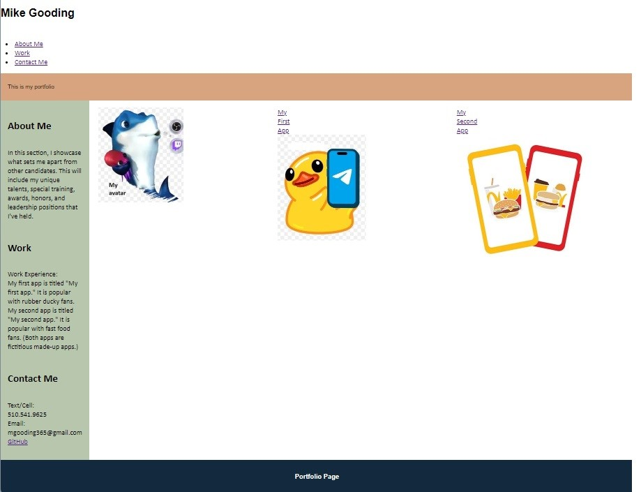

# Portfolio Page

## Description

This is my portfolio page.
It contains my work experience and how to contact me.

## Source Code

I sourced code from 02-Advanced-CSS/01-Activities/03-Ins_Flexbox-Layout as HTML starter code.

## Installation

To install this project, first I established the HTML structure, and then I styled the page with CSS.

For example, first the work experience text was typed in HTML. Then CSS styles were applied to position the work experience along the left side of the page and the app images on the right side.

## Usage

You can use this page to get info on my experience, work, and development projects.

Website address:  https://github.com/nimilico/portfolio-page.git

Screenshot:

## Credits

I sourced from Indeed.com suggestions how to compose wording for work experience:

https://www.indeed.com/career-advice/resumes-cover-letters/write-work-experience-on-a-resume

## License

MIT License has been applied.

